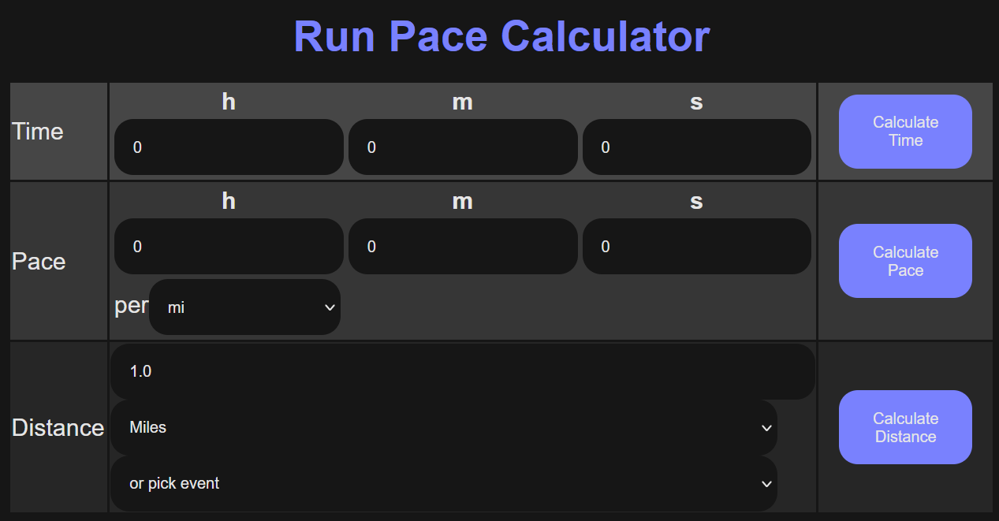

# fpace - Run Pace Calculator 

fpace is a running pace calculator inspired by the [Cool Running pace calculator](https://a.atmos.washington.edu/~ovens/racepace.html). 

It is written in F# and works in the browser using [Fable](http://fable.io/) and [Feliz](https://github.com/Zaid-Ajaj/Feliz).



Try it [online](https://www.slater.dev/fpace)

## Getting Started

* Install [.NET 7](https://dotnet.microsoft.com/en-us/download/dotnet/7.0) or newer
* Install [node.js](https://nodejs.org) v18+ LTS

```powershell
git clone https://github.com/nref/fpace
pushd fpace
pwsh init.ps1
```

## Development

Before doing anything, start with installing npm dependencies by running `init.ps1` or using `npm install`.

Then to start development mode with hot module reloading, run:
```bash
npm start
```
This will start the development server after compiling the project, once it is finished, navigate to http://localhost:8080 to view the application .

To build the application and make ready for production:
```
npm run build
```
This command builds the application and puts the generated files into the `deploy` directory (can be overwritten in webpack.config.js).

### Tests

The template includes a test project that ready to go which you can either run in the browser in watch mode or run in the console using node.js and mocha. To run the tests in watch mode:
```
npm run test:live
```
This command starts a development server for the test application and makes it available at http://localhost:8085.

To run the tests using the command line and of course in your CI server, you have to use the mocha test runner which doesn't use the browser but instead runs the code using node.js:
```
npm test
```
